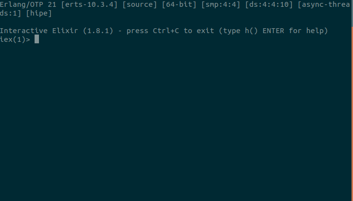
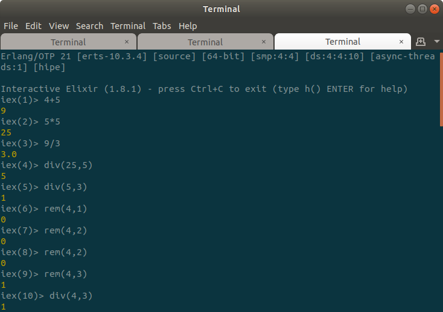

# ELIXIR bagian: 1

### Sesi interaktif
------
elixir hadir lengkap dengan interactive-shell yang membantu untuk mengeksekusi program dengan cepat, kebutuhan mendadak, atau sekedar ingin mencoba tanpa perlu membuat 1 full script. Untuk memasang elixir di sistem operasi kalian, bisa melihat dari situs [resminya](https://elixir-lang.org/install.html)

Usai memasang, pastikan kalian dapat melihat versi dari elixir yang kalian gunakan di terminal kalian.
`elixir --version`

Maka akan muncul teks yang kurang lebih seperti ini:

```Erlang/OTP 21 [erts-10.3.4] [source] [64-bit] [smp:4:4] [ds:4:4:10] [async-threads:1] [hipe]```

```Elixir 1.8.1 (compiled with Erlang/OTP 20)```

Untuk masuk ke interactive shell, ketik `iex`

### Built-in types
------
Dalam elixir, seperti bahasa pemograman lainnya memiliki beberapa tipe data penunjang (basic types) antara lain:
1. **integer** = bilangan bulat yang dapat ditulis dengan format berikut:
	- 1
	- 0x1F
2. **float** = bilangan desimal. Biasa ditulis dengan `titik` diakhir angka. (contoh: 1.0)
3. **boolean** = terdiri dari nilai `true` dan `false`
4. **atom/symbol** = buat kalian tidak familiar dengan ini, konsep atom/symbol ini digunakan agar mudah dibaca oleh manusia. Nilai dari atom tersebut adalah namanya itu sendiri. (contoh: :ok, :error) (Ini tidak sepenuhnya sama dengan Ruby)
5. **string** = merupakan *list* dari *char*. Sama seperti bahasa pemograman lain. Berisi teks. Di elixir, *string* menggunakan *double-quotes* dan di *encode* menggunakan UTF-8
6. **list** =  kumpulan dari variabel yang dirangkai menjad sebuah *linked list*(contoh: [1,2,3])
7. **Map** = padanan Map untuk java adalah *Map* itu sendiri dan jika di Python konsep ini sama dengan *dictionary*, yakni terdiri dari pasangan *key-value*
8. **Process** = sebuah thread ringan
9. **Port** = mekanisme untuk berinteraksi diluar *environment*
10. **Tuple** = kumpulan dari elemen seperti *list*, namun panjang dan nilainya sudah *fixed* (tidak dapat diubah, ditambah maupun dihapus) (contoh: {1,2,3})

### Mencoba menulis code di elixir
------
Pada bagian ini saya akan menjabarkan hal-hal sederhana yang dapat digunakan menggunakan elixir.

Ketik `iex` di terminal kalian maka akan muncul seperti dibawah ini (Termasuk perintah untuk keluar adalah `ctrl+c` kemudian pilih `a` (*abort*)):


[](https://asciinema.org/a/242839)

Selanjutnya kita akan mencoba menulis beberapa perintah sederhana. Pada contoh kali ini kita coba dengan aritmatika sederhana, operasi string dan menulis atom/symbol.



Untuk notasi aritmatika pada elixir sama saja dengan bahasa pemograman lain seperti Java, Javascript dan Python (Notasi: +,-, *, /). Di elixir juga sudah disediakan fungsi bawaan atau sering disebut dengan `kernel`. `kernel` ini berisi perintah primitif seperti operasi aritmatika, pengolahan data dan lain-lain. `Macros` juga termasuk ke dalam `kernel` pada elixir. Serta `guard` yang digunakan untuk melakukan pemadanan pola. Kalian bisa menggunakan `kernel` dari elixir dimana saja (dapat langsung digunakan).


